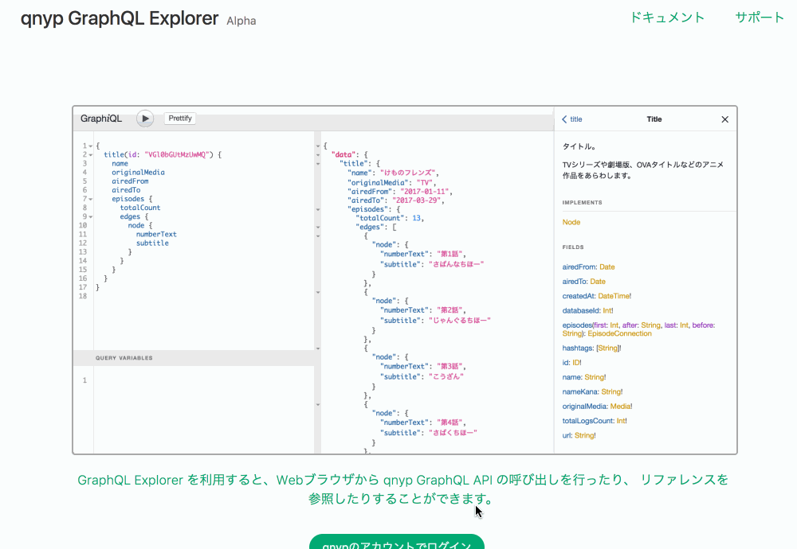
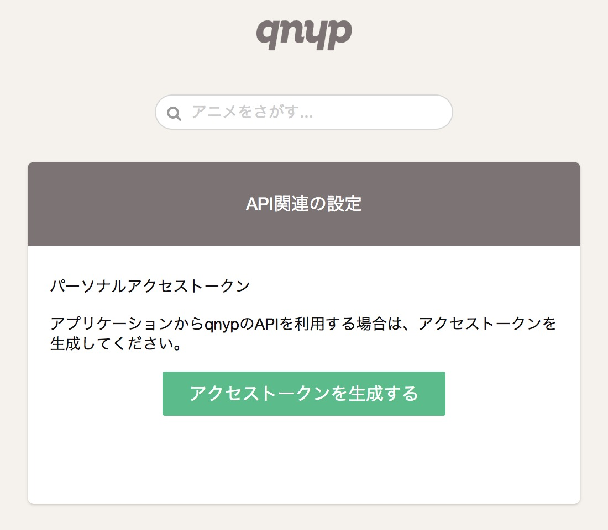
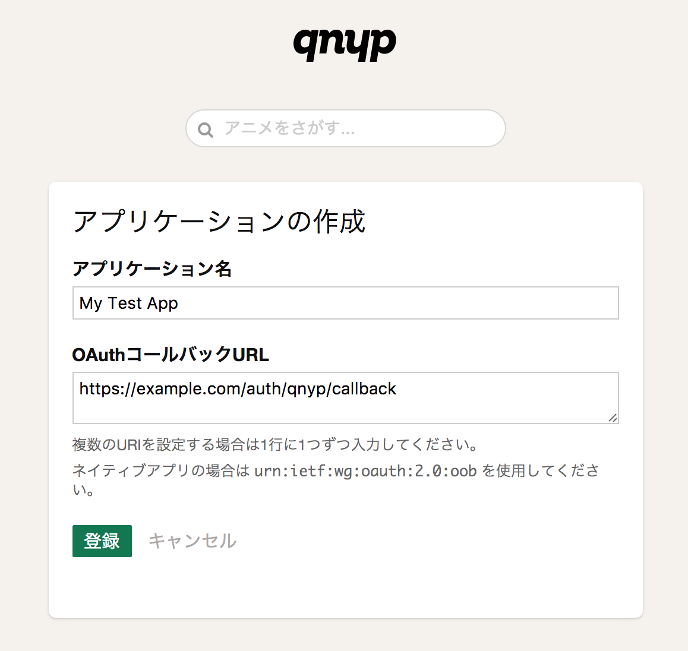
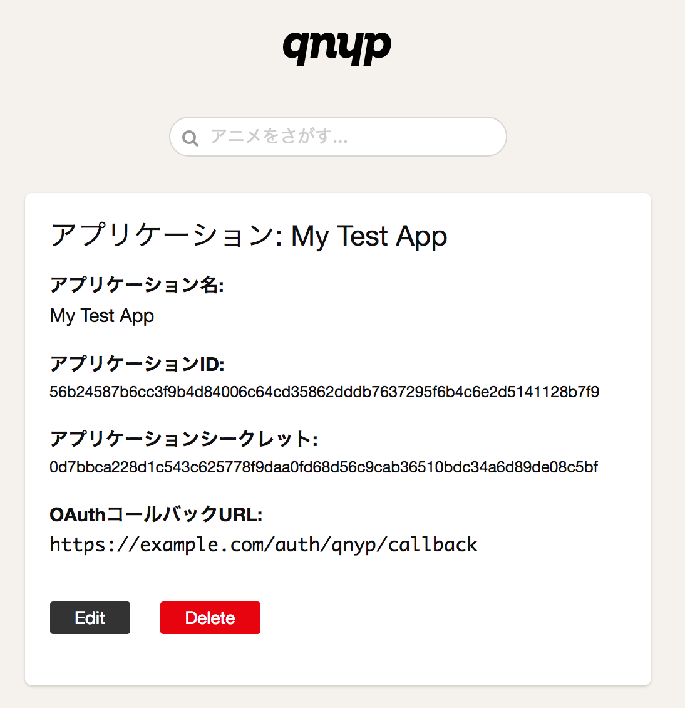

# APIリファレンス

このページでは、qnyp GraphQL API(以下API)の仕様について解説します。

APIを利用すると、qnypに登録されている情報を取得したり、ユーザーとしてエピソードの感想を記録することができます。

<aside class="notice">
このAPIはベータ版です。現時点では仕様の安定性や稼働率についての保証はありません。
</aside>


# 1. Overview

APIはGraphQLをベースとしています。すべてのリクエストはエンドポイント `https://api.qnyp.com/graphql` に対して送信します。

以下のGraphQLクライアントライブラリおよびクライアントソフトウェアでの動作を確認しています。

- [graphql-ruby](https://github.com/github/graphql-client) - Ruby
- [Apollo Client](http://dev.apollodata.com/) - JavaScript
- [GraphiQL.app](https://github.com/skevy/graphiql-app) - A light, Electron-based wrapper around GraphiQL

また、Ruby開発者向けに以下のライブラリおよびサンプルを公開しています。

- [omniauth-qnyp](https://github.com/qnyp/omniauth-qnyp) - omniauth用ストラテジー
- [qnyp-graphql-example-ruby](https://github.com/qnyp/qnyp-graphql-example-ruby) - graphql-clientを使ったサンプル


# 2. Authorization

APIを利用するにはアクセストークンが必要となります。

アクセストークンは以下のいずれかの方法で取得します。

1. パーソナルアクセストークンを利用する
2. OAuth2アプリケーションをqnypに登録し、ユーザーからの許可を得てアクセストークンを取得する

それぞれの想定するユースケースは以下の通りです。

- パーソナルアクセストークン
  - 自分用のツールを作成する場合
  - GraphQLクライアントアプリケーションからAPIを呼び出す場合
- OAuth2アプリケーション
  - qnypユーザー向けのWebアプリケーションを公開する場合
  - qnypユーザー向けのモバイルアプリやデスクトップアプリを公開する場合

また、APIを試してみたい場合には、[qnyp GraphQL Explorer](https://graphql-explorer.qnyp.com/)を利用することでアクセストークンをあらかじめ準備することなく、APIの呼び出しやドキュメントの参照を行うことができます。




## 2.1. パーソナルアクセストークン

パーソナルアクセストークンとは、qnypのユーザーが自分で生成・破棄を行うことができるアクセストークンです。

パーソナルアクセストークンを生成するには、qnypにログインした状態で [https://qnyp.com/settings/api](https://qnyp.com/settings/api) へアクセスして、アクセストークンの生成操作を行います。



パーソナルアクセストークンに有効期限はありませんが、ユーザーはいつでも設定ページから自分のアクセストークンを無効化することができます。


## 2.2. OAuth2アプリケーション

OAuth2アプリケーションとしてユーザーの許可を得てアクセストークンを取得するには、まずqnypにログインしている状態で [https://qnyp.com/oauth/applications](https://qnyp.com/oauth/applications) にてアプリケーションの登録(作成)を行います。



アプリケーションの登録が完了すると「アプリケーションID」と「アプリケーションシークレット」が発行されるので、これを使ってOAuth2の認可フローを開始します。



<aside class="notice">
Rubyの場合は <a href="https://github.com/qnyp/omniauth-qnyp">omniauth-qnyp</a> を利用することで、以降の説明にある処理を実装することなくアクセストークン取得までのフローを処理することができます。
</aside>

### 2.2.1 認可フロー

ここでは、qnypのユーザーからアプリケーションに対する認可を得る手順について説明します。

なお、qnypではOAunt 2.0で定義されている認可フローのうち「認可コードフロー(Authorization Code Flow)」のみをサポートしていますので、以降で説明する手順はそれに沿ったものとなります。

**qnypへのリダイレクト:**

ユーザーに認可を求めるには、まずあなたのアプリケーションから次ようなURLへのリダイレクトを行います。

`GET https://qnyp.com/oauth/authorize?client_id={アプリケーションID}&response_type=code&scope={スコープ}&redirect_uri={コールバックURL}&state={anti-forgery-token}`

- `client_id`には登録したアプリケーションの「アプリケーションID」を指定します。
- `scope`にはユーザーに求める権限をスペース区切りおよびURLエンコードした文字列で指定します(例:`public%20write`)。スコープの詳細については「3. スコープ」を参照してください。
- `redirect_uri`には認可後にユーザーが戻ってくるあなたのアプリケーションのURLを指定します。このURLは、登録したアプリケーションのコールバックURLに含まれている必要があります。
- `state`に指定された値は、そのままコールバックURLへのリダイレクト時に持ち越されてきます。この値はCSRFを防ぐために使います。

**qnypからのリダイレクト:**

ユーザーがqnyp上で認可の要求を「認証」または「否認」すると、以下のようなURLにユーザーがリダイレクトされてきます。

`GET {コールバックURL}?code={コード}&state={anti-forgery-token}`

**アクセストークンの取得:**

```shell
$ curl -X POST https://api.qnyp.com/oauth/token \
  -d "client_id={アプリケーションID}" \
  -d "client_secret={アプリケーションシークレット}" \
  -d "code={コード}" \
  -d "grant_type=authorization_code" \
  -d "redirect_uri={コールバックURL}"
```

```json
{
  "access_token": "bbfe3562bcf500fafac64397858ee9a8c1676959c9499726a4078218ec1546c9",
  "token_type": "bearer",
  "scope": "public write",
  "created_at": 1493395116
}
```

リダイレクトによって受け取った`code`の値をはじめとする以下のパラメーターをAPIの `/oauth/token` にPOSTリクエストで送信すると、アクセストークンを取得することができます。

| 名前 | 値 |
| ---- | ---- |
| `client_id` | 登録したアプリケーションのアプリケーションID |
| `client_secret` | 登録したアプリケーションのアプリケーションシークレット |
| `code` | qnypからのリダイレクトで受け取ったコード |
| `grant_type` | `authorization_code` |
| `redirect_uri` | 登録したアプリケーションのコールバックURL |

レスポンスは以下の値を含むJSONとなります。

| 名前 | 値 |
| ---- | ---- |
| `acces_token` | アクセストークン |
| `token_type` | `bearer` |
| `scope` | アクセストークンが持つスコープ(半角スペース区切り) |
| `created_at` | アクセストークンの生成日時(UNIXタイムスタンプ) |

発行されたアクセストークンに有効期限はありません。

<aside class="notice">
qnypからのリダイレクトで受け取ったコードの有効期限は10分間です。
10分を経過した場合、そのコードを使ってアクセストークンを取得することはできません。
</aside>

## 2.3. アクセストークンによる認証

アクセストークンを使ってAPIへのリクエストを行うには、`Authorization` ヘッダに `Bearer` タイプとしてアクセストークンを指定します。

`Authorization: Bearer アクセストークン`


# 3. Scopes

アクセストークンの持つスコープによって、利用できるAPIが異なります。

| API | 必要なスコープ |
| ---- | ---- |
| GraphQLのQuery | `public` |
| GraphQLのMutation | `public` および `write` |

公開情報の参照のみでよい場合は `public` スコープを、視聴ログの作成などの書き込み操作を行う場合は `public` と `write` スコープの両方を要求してください。

<aside class="notice">
スコープを持たないアクセストークンはGraphQL APIの情報に一切アクセスできません。
</aside>


# 4. Errors

APIは、エラーが発生した際に以下のステータスコードを返します。

コード | 意味
---------- | -------
401 | アクセストークンが無効である
403 | アクセストークンがAPIリクエストに必要な権限を持っていない
404 | 無効なエンドポイントをリクエストした
429 | リクエスト数が上限に達している
500 | サーバー側でエラーが発生した
503 | APIがメンテナンス中である

また、GraphQLリクエストに含まれるQueryおよびMutationの実行中に発生するエラー(バリデーションエラーなど)の場合のステータスコードは200となり、エラーの詳細がレスポンスボディに含まれます。


# 5. Rate limiting

```text
# 通常時のレスポンス
X-RateLimit-Limit: 500
X-RateLimit-Remaining: 499
X-RateLimit-Reset: Tue, 14 Mar 2017 16:16:00 GMT
```

```text
# リクエスト数が上限に達した場合のレスポンス
429 Too Many Requests

Retry-After: 3600
X-RateLimit-Limit: 500
X-RateLimit-Remaining: 0
X-RateLimit-Reset: Tue, 14 Mar 2017 16:16:00 GMT
```

APIへのリクエスト数の上限は、アクセストークン毎に1時間あたり500回までとなっています。

リクエスト数の残数や回数がリセットされる日時などの情報は、APIのレスポンスヘッダに以下のような形で含まれています。

| ヘッダ | 値 |
| ---- | ---- |
| `X-RateLimit-Limit` | リクエスト数の上限 |
| `X-RateLimit-Remaining` | リクエスト数の残り回数 |
| `X-RateLimit-Reset` | リクエスト数がリセットされる日時 |

リクエスト数が上限に達した場合は、ステータスコード429のレスポンスが返されます。また、その際にリクエスト数がリセットされるまでの秒数が `Retry-After` レスポンスヘッダで返されます。
